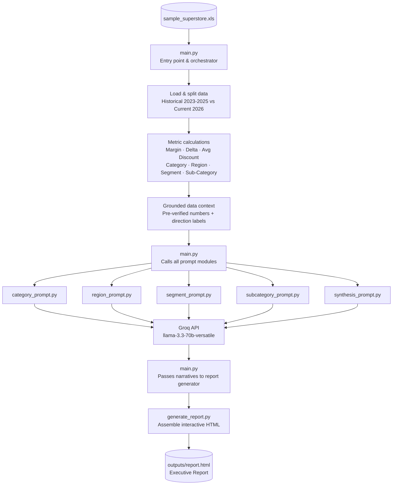

# Pipeline Architecture

## Flowchart

```mermaid
flowchart TD
    A[("sample_superstore.xls")] --> B["main.py\nEntry point & orchestrator"]
    B --> C["Load & split data\nHistorical 2023-2025 vs Current 2026"]
    C --> D["Metric calculations\nMargin · Delta · Avg Discount\nCategory · Region · Segment · Sub-Category"]
    D --> E["Grounded data context\nPre-verified numbers + direction labels"]
    E --> F["main.py\nCalls all prompt modules"]
    F --> F1["category_prompt.py"]
    F --> F2["region_prompt.py"]
    F --> F3["segment_prompt.py"]
    F --> F4["subcategory_prompt.py"]
    F --> F5["synthesis_prompt.py"]
    F1 --> G["Groq API\nllama-3.3-70b-versatile"]
    F2 --> G
    F3 --> G
    F4 --> G
    F5 --> G
    G --> H["main.py\nPasses narratives to report generator"]
    H --> I["generate_report.py\nAssemble interactive HTML"]
    I --> J[("outputs/report.html\nExecutive Report")]
```